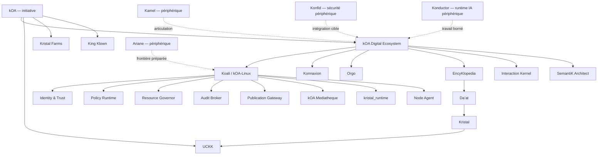

# Vue Mermaid — graphe kOA

```mermaid
flowchart TD
  KOA["kOA — initiative"]
  DE["kOA Digital Ecosystem"]
  KOA --> DE
  KOA --> UCKK["UCKK"]
  KOA --> KF["Kristal Farms"]
  KOA --> KK["King Klown"]
  DE --> KOALI["Koali / kOA-Linux"]
  KOALI --> IT["Identity & Trust"]
  KOALI --> GPR["Policy Runtime"]
  KOALI --> RG["Resource Governor"]
  KOALI --> AB["Audit Broker"]
  KOALI --> PG["Publication Gateway"]
  KOALI --> KM["kOA Mediatheque"]
  KOALI --> KRT["kristal_runtime"]
  KOALI --> NA["Node Agent"]
  DE --> KX["Konnaxion"]
  DE --> ORGO["Orgo"]
  DE --> ENC["EncyKlopedia"]
  ENC --> DAAT["Da’at"]
  DAAT --> KR["Kristal"]
  DE --> IK["Interaction Kernel"]
  DE --> SA["SemantiK Architect"]
  AR["Ariane — périphérique"] -. frontière préparée .-> KOALI
  KAM["Kamel — périphérique"] -. articulation .-> DE
  KFID["Konfid — sécurité périphérique"] -. intégration cible .-> DE
  KOND["Konductor — runtime IA périphérique"] -. travail borné .-> DE
  KR --> UCKK
```
