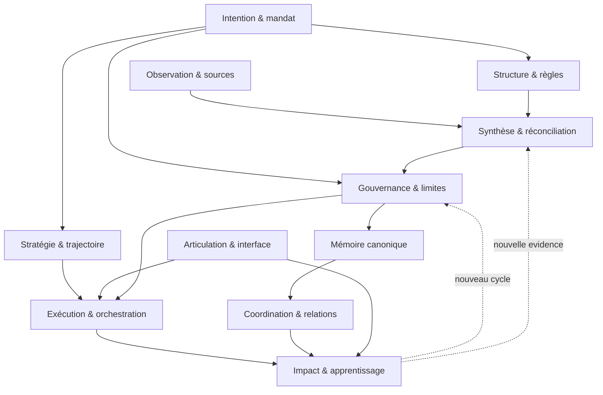

# Vue Mermaid — fonctions opératoires

```mermaid
flowchart TD
  I["Intention & mandat"]
  O["Observation & sources"]
  S["Structure & règles"]
  Y["Synthèse & réconciliation"]
  G["Gouvernance & limites"]
  C["Mémoire canonique"]
  R["Coordination & relations"]
  T["Stratégie & trajectoire"]
  A["Articulation & interface"]
  E["Exécution & orchestration"]
  F["Impact & apprentissage"]
  I --> S
  I --> T
  I --> G
  O --> Y
  S --> Y
  Y --> G
  G --> C
  C --> R
  T --> E
  A --> E
  G --> E
  E --> F
  R --> F
  A --> F
  F -. nouveau cycle .-> G
  F -. nouvelle evidence .-> Y
```
